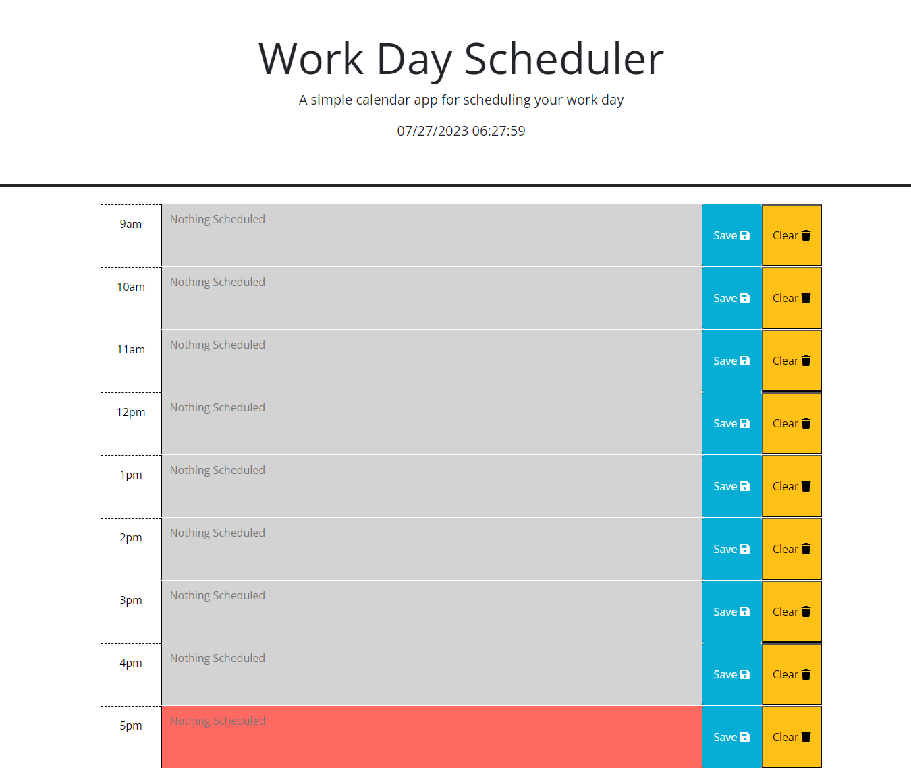

# Work Day Scheduler: Module 5 Challenge

## Description

The goal of this project was to build a web app that functions as a scheduler, one that would allow the user to save events for each hour of a typical working day. It features dynamically updated HTML and CSS powered by JavaScript and jQuery, as well as the Dayjs library.

## Finished Project

### Comments

* The scheduler features 9 time-blocks, starting at 9am and ending at 5pm. The color of each text-block will change color depending on whether it is in the past(grey), present(red), or future(green).
* Any text entered into the text field of an individual time-block can be saved to local storage using the provided save button. Once in local storage, it will remain displayed in that time-block upon reloading of the page, unless cleared using the provided clear button.
* There is a display in the header of the current date and time, updating every second with the current time.

### Deployed Website

[ Click Here to View Deployed Website](https://newprice247.github.io/Work-Day-Scheduler/)

## Contact Me

[Nathaniel Price](https://github.com/newprice247) @ Github
